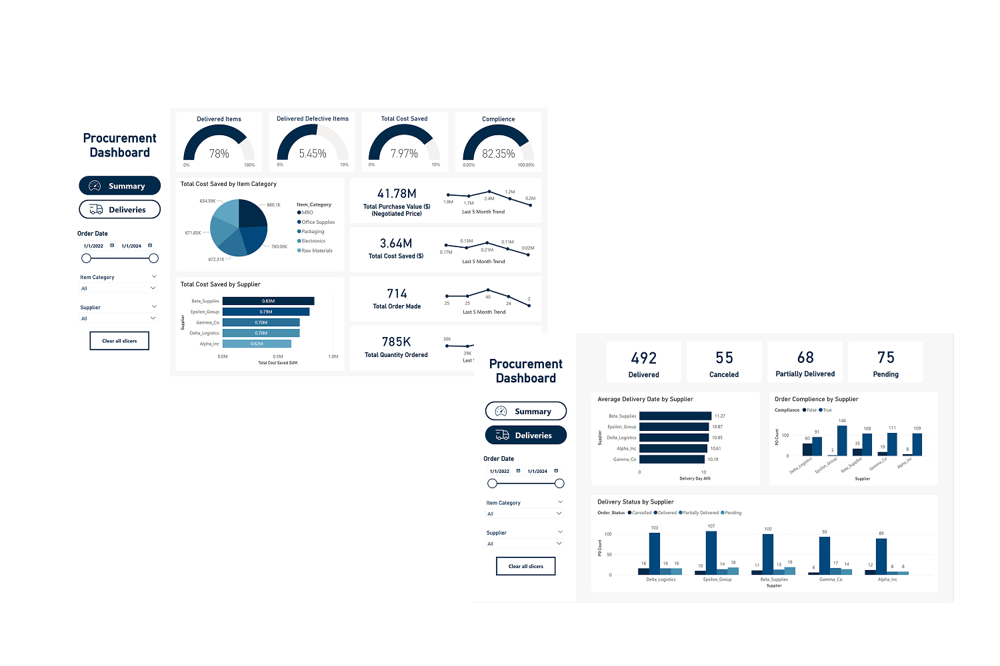

# Procurement Dashboard (Power BI)

This project is a **Procurement Analysis Dashboard** built using **Microsoft Power BI**. It provides insights into procurement performance, vendor efficiency, purchasing trends, and cost analysis to support data-driven decision-making in supply chain and procurement operations.

## 📊 Dashboard Overview

The dashboard includes:

- Top 5 vendors and item categories from the last few months
- Deliveries performance evaluation
- Product category insights
- KPIs like Total Purchase Orders, Top Vendors, and Category Distribution

> 🔍 **Goal**: Help procurement teams monitor efficiency, optimize vendor relationships, and identify cost-saving opportunities.

## 📁 Dataset

The dataset used for this dashboard was sourced from Kaggle.

- Source: [Kaggle Procurement Dataset](https://www.kaggle.com/datasets/shahriarkabir/procurement-kpi-analysis-dataset/data)
- Contains procurement transaction data including purchase order dates, vendors, item categories, quantities, and prices.

## 🖼️ Screenshot

*Replace with your actual image path or URL*

## 🔗 Project Access

You can view or download the Power BI report here:

👉 [View Power BI Report](https://app.powerbi.com/view?r=eyJrIjoiNWZiN2I3ZTQtNTRhMy00YzcwLWEyYmMtZWVmNzhjZThkMzA3IiwidCI6IjM0ODViOTYzLTgyYmEtNGE2Zi04MTBmLWI1Y2MyMjZmZjg5OCIsImMiOjEwfQ%3D%3D)

## ⚙️ Tools Used

- **Microsoft Power BI**
- **Excel / CSV** (for data pre-processing)
- **Kaggle** (data source)

## 📌 How to Use

1. Download the `.pbix` file from the link above.
2. Open it in Power BI Desktop.
3. Explore and interact with the dashboard visuals.

## 📃 License

This project is licensed under the MIT License.

---

Feel free to reach out if you have feedback or would like to collaborate!
